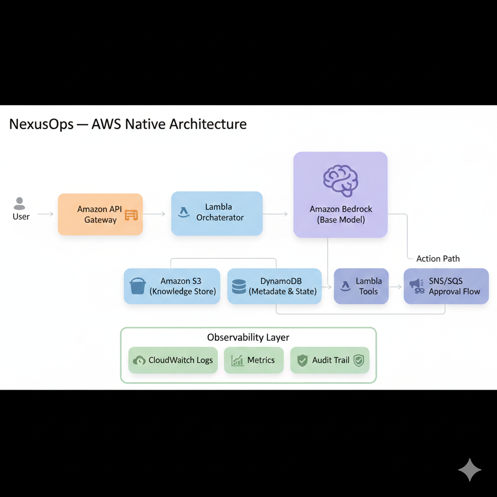
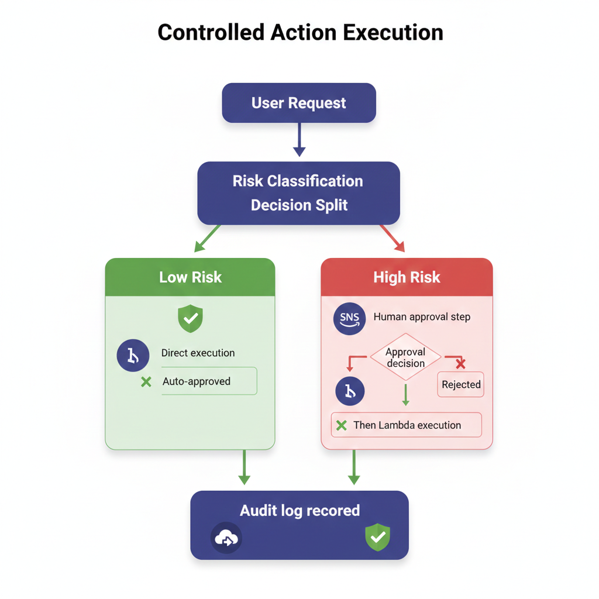

# NexusOps

**NexusOps** is an AWS-native, guardrail-first agentic execution system designed to safely reason, retrieve knowledge, and execute cloud actions with explicit controls, cost awareness, and auditability.

The system follows a **bounded agentic loop** that avoids uncontrolled agent chaining while still enabling intelligent automation on AWS.

---

## 🧠 Core Design Principles

- **AWS-native only** (no external orchestration engines)
- **Single model invocation** (bounded reasoning)
- **Explicit approvals for high-risk actions**
- **Internal knowledge grounding**
- **First-class observability and auditability**
- **Free-tier–aligned architecture (where applicable)**

---

## 🔁 NexusOps Agentic Execution Loop

This diagram represents the **end-to-end agentic flow** followed by NexusOps for every request.

### Flow Summary

1. **Ask** – Developer submits a request via API or UI  
2. **Retrieve** – Context is fetched only from approved internal sources  
3. **Reason** – A single Amazon Bedrock base model invocation synthesizes a grounded response  
4. **Act** – Only allow-listed AWS Lambda actions may execute  
5. **Verify** – Guardrails, cost caps, and audits are enforced before completion  

---

## 🧱 AWS-Native System Architecture

The following diagram shows how NexusOps is composed entirely of managed AWS services.

### Key Components

- **Amazon API Gateway** – Secure entry point
- **AWS Lambda (Orchestrator)** – Central control plane
- **Amazon Bedrock (Base Model)** – Reasoning layer (no AgentCore)
- **Amazon S3** – Internal knowledge store
- **Amazon DynamoDB** – Metadata, state, and trace storage
- **SNS / SQS** – Human approval workflows
- **CloudWatch + CloudTrail** – Observability and audit layer

---

## 🧠 Bounded Reasoning Model

NexusOps enforces **bounded reasoning** to prevent runaway agent behavior.

### Guarantees

- Exactly **one model invocation per request**
- **No external data access**
- **No agent chaining**
- **Token-capped responses**
- Outputs include:
  - Answer
  - Citations
  - Assumptions
  - Limitations

This ensures predictability, cost control, and explainability.

---

## ⚙️ Controlled Action Execution

Actions are executed only after **risk classification**.

### Execution Logic

- **Low-risk actions**
  - Auto-approved
  - Direct Lambda execution
- **High-risk actions**
  - Routed through SNS for human approval
  - Explicit approve / reject decision
- All outcomes are **immutably logged**

---

## ✅ Verification & Guardrails

Every response and action is validated before completion.

### Enforcement Layers

- Action result validation
- IAM policy enforcement
- Citation verification
- Bedrock Guardrails
- Cost monitoring
- CloudWatch logging

No response bypasses this stage.

---

## 🔍 Observability & Auditability

NexusOps provides full operational visibility:

- CloudWatch Logs & Metrics
- CloudTrail audit records
- Cost usage monitoring
- Request-to-action traceability

This makes NexusOps suitable for **enterprise, regulated, and safety-critical environments**.

---

## 🚀 Status

This repository currently contains:
- System design documentation
- Architecture and execution diagrams
- Guardrail and reasoning models

Implementation modules will be added incrementally.

---

## 📄 License

License to be added.
