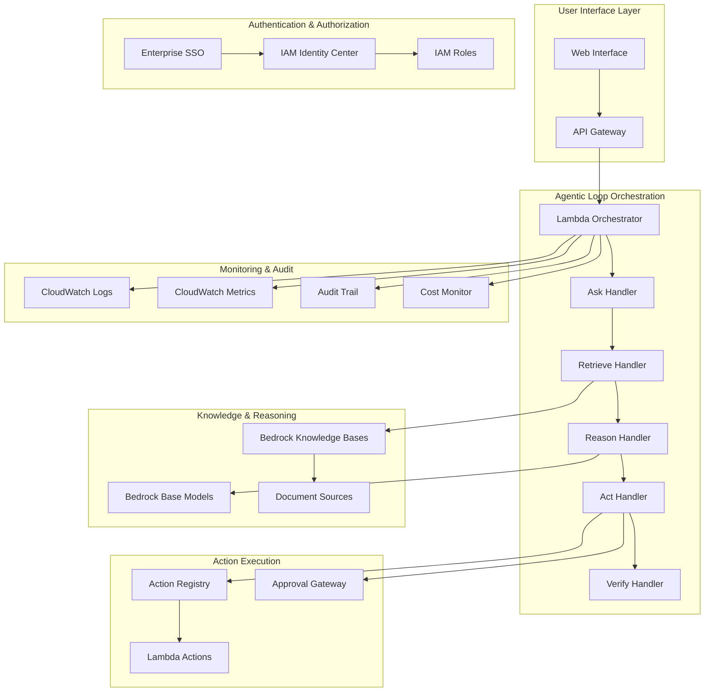

# Design Document: NexusOps

## Overview

NexusOps is an AWS-native agentic AI engineering assistant that implements a strict 5-step agentic loop (Ask → Retrieve → Reason → Act → Verify) using direct Amazon Bedrock base model invocation. The system prioritizes cost predictability, security, and governance by excluding managed multi-step agent orchestration services and maintaining Free Tier alignment.

The architecture follows AWS Well-Architected Framework principles with emphasis on:
- **Security**: IAM least privilege, encryption at rest/transit, enterprise SSO integration
- **Cost Optimization**: Free Tier prioritization, strict token limits, usage monitoring
- **Reliability**: Bounded single-step reasoning, explicit failure modes, audit trails
- **Performance**: Direct API calls, minimal latency, concurrent execution limits
- **Operational Excellence**: Infrastructure as code, monitoring, automated deployment

## Architecture

### High-Level Architecture



### AWS Service Mapping

| Component | AWS Service | Free Tier Eligibility |
|-----------|-------------|----------------------|
| API Gateway | Amazon API Gateway HTTP API | 1M requests/month (12 months) |
| Orchestrator | AWS Lambda | 1M requests + 400K GB-seconds/month |
| Knowledge Base | Amazon Bedrock Knowledge Bases | Pay-per-use (optimized) |
| Base Models | Amazon Bedrock (direct invocation) | Pay-per-token (bounded) |
| Authentication | AWS IAM Identity Center | Free |
| Logging | Amazon CloudWatch Logs | 5GB ingestion/month |
| Metrics | Amazon CloudWatch Metrics | 10 custom metrics |
| Storage | Amazon S3 | 5GB standard storage |
| Database | Amazon DynamoDB | 25GB storage + 25 RCU/WCU |

## Components and Interfaces

### 1. API Gateway Layer

**Purpose**: Secure HTTP endpoint for user interactions with enterprise authentication

**Interface**:
```typescript
interface NexusOpsAPI {
  // Query submission
  POST /query
  Body: {
    query: string;
    context?: Record<string, any>;
    user_identity: string;
  }
  Response: {
    request_id: string;
    status: "processing" | "completed" | "failed";
    result?: QueryResult;
  }
  
  // Action approval
  POST /approve/{request_id}
  Body: {
    action: "approve" | "deny";
    reason?: string;
  }
  
  // Status polling
  GET /status/{request_id}
  Response: {
    status: string;
    progress: AgenticLoopStep;
    result?: QueryResult;
  }
}

interface QueryResult {
  answer: string;
  citations: Citation[];
  confidence_score: number;
  limitations: string[];
  assumptions: string[];
  trade_offs: string[];
  failure_modes: string[];
}
```

**AWS Configuration**:
- HTTP API with IAM authorization
- Request validation and throttling
- CORS configuration for web interface
- CloudWatch logging enabled

### 2. Lambda Orchestrator

**Purpose**: Coordinates the 5-step agentic loop with state management and error handling

**Interface**:
```typescript
interface OrchestrationState {
  request_id: string;
  user_identity: string;
  current_step: AgenticLoopStep;
  query: string;
  retrieved_documents: Document[];
  reasoning_result: ReasoningResult;
  actions_to_execute: Action[];
  verification_status: VerificationStatus;
  audit_trail: AuditEntry[];
}

enum AgenticLoopStep {
  ASK = "ask",
  RETRIEVE = "retrieve", 
  REASON = "reason",
  ACT = "act",
  VERIFY = "verify"
}
```

**Implementation Details**:
- Single Lambda function with step-based routing
- DynamoDB state persistence
- Maximum 15-minute execution time
- Automatic retry with exponential backoff
- Dead letter queue for failed requests

### 3. Knowledge Retrieval System

**Purpose**: RAG implementation using Amazon Bedrock Knowledge Bases with citation tracking

**Interface**:
```typescript
interface KnowledgeRetrieval {
  retrieve(query: string, user_context: UserContext): Promise<RetrievalResult>;
}

interface RetrievalResult {
  documents: Document[];
  confidence_scores: number[];
  total_results: number;
  search_metadata: SearchMetadata;
}

interface Document {
  content: string;
  source_url: string;
  last_modified: Date;
  author: string;
  document_type: "github" | "confluence" | "jira" | "slack" | "s3";
  confidence_score: number;
}
```

**Implementation Strategy**:

**MVP Mode (Free Tier Optimized)**:
- Deterministic retrieval from Amazon S3 using metadata and keyword filtering
- Document metadata indexed in DynamoDB
- No vector ingestion in MVP to maintain Free Tier alignment

**Upgrade Path (Post-MVP)**:
- Amazon Bedrock Knowledge Bases with vector embeddings
- OpenSearch Serverless for vector storage
- Enabled only after explicit cost approval and budget allocation

**Current MVP Implementation**:
- S3 bucket organization by document type and source
- DynamoDB Global Secondary Indexes for metadata queries
- Hybrid search combining keyword matching and metadata filtering
- Source filtering based on user permissions
- Confidence scoring based on keyword relevance and document recency

### 4. Reasoning Engine

**Purpose**: Direct Bedrock base model invocation with bounded, single-step reasoning

**Interface**:
```typescript
interface ReasoningEngine {
  reason(
    query: string, 
    documents: Document[], 
    constraints: ReasoningConstraints
  ): Promise<ReasoningResult>;
}

interface ReasoningConstraints {
  max_input_tokens: number;    // 300 default (Free Tier safe)
  max_output_tokens: number;   // 100 default (Free Tier safe)
  temperature: number;         // 0.1 for consistency
  require_citations: boolean;  // Always true
  min_supporting_docs: number; // 2 minimum
  note: "Token limits are configurable but default to Free Tier-safe values";
}

interface ReasoningResult {
  answer: string;
  citations: Citation[];
  confidence_score: number;
  assumptions: string[];
  limitations: string[];
  trade_offs: string[];
  failure_modes: string[];
  token_usage: TokenUsage;
}
```

**Model Selection Strategy**:
- Primary: Amazon Titan Text G1 - Express (cost-optimized)
- Fallback: Anthropic Claude 3 Haiku (quality-optimized)
- Token limits enforced at API level
- Single invocation per query (no chaining)

### 5. Action Registry and Execution

**Purpose**: Allowlisted Lambda function execution with approval workflows

**Interface**:
```typescript
interface ActionRegistry {
  listActions(user_permissions: string[]): Action[];
  executeAction(action_id: string, parameters: any, user_context: UserContext): Promise<ActionResult>;
  requiresApproval(action_id: string): boolean;
}

interface Action {
  id: string;
  name: string;
  description: string;
  parameters_schema: JSONSchema;
  required_permissions: string[];
  risk_level: "low" | "medium" | "high";
  lambda_function_arn: string;
}
```

**Allowlisted Actions (MVP)**:
- `describe-infrastructure`: Read-only AWS resource description
- `validate-configuration`: Configuration file validation
- `generate-documentation`: Template-based documentation generation
- `check-compliance`: Policy compliance verification

### 6. Human-in-the-Loop Approval

**Purpose**: Approval workflow for high-risk actions with timeout handling

**Interface**:
```typescript
interface ApprovalGateway {
  requestApproval(request: ApprovalRequest): Promise<string>; // Returns approval_id
  checkApprovalStatus(approval_id: string): Promise<ApprovalStatus>;
  processApprovalResponse(approval_id: string, response: ApprovalResponse): Promise<void>;
}

interface ApprovalRequest {
  action: Action;
  parameters: any;
  requester: string;
  risk_assessment: RiskAssessment;
  expected_outcome: string;
}

interface ApprovalStatus {
  status: "pending" | "approved" | "denied" | "expired";
  approver?: string;
  reason?: string;
  expires_at: Date;
}
```

**Implementation**:
- SNS notifications to approvers
- SQS queue for approval responses
- 15-minute default timeout
- Escalation to secondary approvers after 10 minutes
- Audit logging of all approval decisions

## Data Models

### User Context and Identity

```typescript
interface UserContext {
  user_id: string;
  email: string;
  roles: string[];
  permissions: string[];
  organization: string;
  session_id: string;
  assumed_role_arn: string;
}

interface SessionData {
  user_context: UserContext;
  created_at: Date;
  expires_at: Date;
  last_activity: Date;
  ip_address: string;
}
```

### Query and Response Models

```typescript
interface QueryRequest {
  query: string;
  context?: Record<string, any>;
  user_identity: string;
  request_metadata: {
    timestamp: Date;
    ip_address: string;
    user_agent: string;
  };
}

interface Citation {
  source_url: string;
  title: string;
  author: string;
  last_modified: Date;
  excerpt: string;
  confidence_score: number;
  document_type: string;
}
```

### Audit and Compliance Models

```typescript
interface AuditEntry {
  event_id: string;
  timestamp: Date;
  user_id: string;
  event_type: AuditEventType;
  resource: string;
  action: string;
  result: "success" | "failure" | "partial";
  details: Record<string, any>;
  ip_address: string;
}

enum AuditEventType {
  QUERY_SUBMITTED = "query_submitted",
  DOCUMENTS_RETRIEVED = "documents_retrieved", 
  REASONING_COMPLETED = "reasoning_completed",
  ACTION_REQUESTED = "action_requested",
  ACTION_APPROVED = "action_approved",
  ACTION_EXECUTED = "action_executed",
  VERIFICATION_COMPLETED = "verification_completed"
}
```

### Cost Monitoring Models

```typescript
interface CostMetrics {
  period: string; // "daily" | "monthly"
  bedrock_tokens: {
    input_tokens: number;
    output_tokens: number;
    cost_usd: number;
  };
  lambda_invocations: {
    count: number;
    duration_ms: number;
    cost_usd: number;
  };
  api_gateway_requests: {
    count: number;
    cost_usd: number;
  };
  total_cost_usd: number;
  free_tier_remaining: FreeTierStatus;
  note: "Cost tracking is per-request and near real-time, with AWS Cost Explorer providing delayed billing data";
}

interface FreeTierStatus {
  lambda_requests_remaining: number;
  lambda_compute_seconds_remaining: number;
  api_gateway_requests_remaining: number;
  cloudwatch_logs_gb_remaining: number;
  s3_storage_gb_remaining: number;
  dynamodb_rcu_wcu_remaining: number;
}
```

## Correctness Properties

*A property is a characteristic or behavior that should hold true across all valid executions of a system—essentially, a formal statement about what the system should do. Properties serve as the bridge between human-readable specifications and machine-verifiable correctness guarantees.*

### Property 1: Query Validation and Processing
*For any* user query submitted to the system, the Query_Handler should validate the query format and content, reject unsafe content with feedback, initiate the Agentic_Loop for valid queries, and log all queries with timestamps and user identification.
**Validates: Requirements 1.1, 1.2, 1.3, 1.4, 1.5**

### Property 2: Knowledge Base Retrieval Constraints
*For any* query that reaches the Retrieve step, the Knowledge_Base should only search pre-approved document repositories, return source metadata for citation, and refuse to answer when fewer than 3 relevant documents are retrieved with confidence score below 0.7.
**Validates: Requirements 2.1, 2.3, 2.4, 2.5, 2.8**

### Property 3: Result Ranking and Conflict Handling
*For any* retrieval operation, results should be ranked by vector similarity score combined with document last-modified timestamp, and when retrieved documents contain conflicting information, multiple cited options should be returned without synthesis.
**Validates: Requirements 2.6, 2.7**

### Property 4: Citation Completeness and Format
*For any* response generated by the system, the Citation_Engine should provide source attribution for every piece of information, include document URLs, timestamps, and authors in a consistent format, list all contributing sources when multiple sources are used, and never provide responses without proper source attribution.
**Validates: Requirements 3.1, 3.2, 3.3, 3.4, 3.5**

### Property 5: Reasoning Constraints and Quality
*For any* reasoning operation, the Reasoning_Engine should process retrieved information with explicit constraints, identify assumptions and limitations, highlight trade-offs and failure modes, never contradict retrieved source material, and refuse to provide recommendations when fewer than 2 supporting documents are available or citation confidence is below 0.7.
**Validates: Requirements 4.1, 4.2, 4.3, 4.4, 4.5, 4.6, 4.7, 4.8**

### Property 6: Token Limit Enforcement
*For any* user query, the system should enforce strict per-request token limits, allow a maximum of one Amazon Bedrock base model invocation per query, and disable or refuse requests that exceed configured Bedrock token limits.
**Validates: Requirements 4.11, 8.7, 8.8**

### Property 7: Action Registry Security
*For any* action execution request, the Action_Registry should only execute pre-approved allowlisted AWS Lambda functions, validate all action parameters before execution, check the allowlist for every requested action, reject any action not explicitly approved, and implement timeout and resource limits.
**Validates: Requirements 5.1, 5.2, 5.3, 5.4, 5.6**

### Property 8: Approval Workflow Management
*For any* high-risk action request, the Approval_Gateway should require human approval before execution, present complete action details to approvers, queue requests with 15-minute default timeout, auto-cancel expired requests, escalate to secondary approvers after 10 minutes, and log all approval decisions with notifications.
**Validates: Requirements 6.1, 6.2, 6.3, 6.5, 6.6, 6.7**

### Property 9: Comprehensive Audit Logging
*For any* system operation, the Audit_Logger should log all user queries, retrieval operations, reasoning steps, action executions, and verification steps with full context and metadata, store logs in tamper-evident format with integrity checks, and support log retention policies.
**Validates: Requirements 5.5, 7.1, 7.2, 7.3, 7.4, 7.5, 7.6, 7.7**

### Property 10: Cost Monitoring and Free Tier Management
*For any* AWS service usage, the Cost_Monitor should track usage per-request and near real-time, alert when approaching Free Tier limits, implement automatic throttling when cost thresholds are exceeded, prioritize Free Tier services when available, and provide cost reporting capabilities.
**Validates: Requirements 8.1, 8.2, 8.3, 8.5, 8.6**

### Property 11: Security and Access Control
*For any* system access or operation, the Security_Guardrails should implement IAM least privilege principles, enforce encryption at rest and in transit, validate inputs for security threats, implement network security controls, enforce authentication and authorization, and support security monitoring.
**Validates: Requirements 9.1, 9.2, 9.3, 9.4, 9.5, 9.6**

### Property 12: Identity and Role Management
*For any* user request, the system should assume specific IAM roles based on authenticated identity, map human identity to system permissions, tie all action executions to the requesting user's identity, implement role separation between readers/executors/approvers, propagate user identity context through all operations, and validate user permissions before allowing access to knowledge sources.
**Validates: Requirements 13.1, 13.2, 13.3, 13.4, 13.5, 13.6**

### Property 13: Verification and Rollback
*For any* completed operation, the NexusOps system should validate that actions completed successfully, verify that responses match retrieved source material, check that all citations are accurate and accessible, validate security and compliance requirements, rollback idempotent actions when verification fails, and require approval plus confirmation for non-reversible actions.
**Validates: Requirements 10.1, 10.2, 10.3, 10.4, 10.5, 10.6, 10.7**

### Property 14: AWS Service Integration
*For any* system component, NexusOps should use only AWS services, prefer Free Tier eligible services when available, use AWS native monitoring and logging services, leverage AWS security services, support infrastructure as code deployment, and use Amazon Bedrock only via direct base model invocation.
**Validates: Requirements 11.1, 11.2, 11.4, 11.5, 11.6, 11.7**

### Property 15: Enterprise System Integration
*For any* external system integration, NexusOps should provide read-only access to GitHub, Confluence, Jira, Slack, and S3, support authentication with enterprise identity providers using scoped access tokens, implement tenant isolation for multi-organization deployments, support SAML and OIDC protocols, maintain session management with configurable timeouts, and never write data back to integrated systems.
**Validates: Requirements 12.1, 12.2, 12.3, 12.4, 12.5, 12.6, 12.7, 12.8, 13.7, 13.8**

## Error Handling

### Error Classification

**User Errors (4xx)**:
- Invalid query format or content
- Insufficient permissions for requested action
- Malformed API requests
- Authentication failures

**System Errors (5xx)**:
- Bedrock API failures or rate limits
- Knowledge Base unavailability
- Lambda function timeouts
- DynamoDB throttling

**Business Logic Errors**:
- Insufficient confidence in retrieved documents
- Conflicting information without resolution
- Action not in allowlist
- Approval timeout expiration

### Error Response Format

```typescript
interface ErrorResponse {
  error_code: string;
  error_message: string;
  error_details: Record<string, any>;
  request_id: string;
  timestamp: Date;
  retry_after?: number; // For rate limiting
  suggestions?: string[]; // For user errors
}
```

### Retry and Circuit Breaker Patterns

**Exponential Backoff**: Applied to transient AWS service failures
- Initial delay: 100ms
- Maximum delay: 30 seconds
- Maximum retries: 3

**Circuit Breaker**: Applied to external service integrations
- Failure threshold: 5 consecutive failures
- Timeout: 60 seconds
- Half-open state: Single test request

**Dead Letter Queue**: Failed requests stored for manual investigation
- Retention: 14 days (cost-optimized)
- Low-volume DLQ only for manual inspection
- SNS notification to administrators
- Automatic retry after service recovery

### Graceful Degradation

**Knowledge Base Unavailable**: 
- Return cached results if available
- Provide error message with retry suggestion
- Log incident for investigation

**Bedrock Rate Limiting**:
- Queue requests with exponential backoff
- Provide estimated wait time to users
- Alert administrators if sustained

**Action Execution Failures**:
- Rollback completed steps where possible
- Provide detailed failure report
- Require manual intervention for non-reversible actions

## Testing Strategy

### Dual Testing Approach

NexusOps employs both unit testing and property-based testing as complementary approaches for comprehensive coverage:

**Unit Tests**: Focus on specific examples, edge cases, and error conditions
- Integration points between AWS services
- Authentication and authorization flows
- Error handling scenarios
- API contract validation

**Property Tests**: Verify universal properties across all inputs through randomization
- Input validation across all possible queries
- Citation completeness for all responses
- Cost limit enforcement under all conditions
- Security constraint validation

### Property-Based Testing Configuration

**Testing Library**: fast-check for TypeScript/JavaScript components
**Test Iterations**: Minimum 100 iterations per property test
**Tagging Convention**: Each property test must reference its design document property

Example test tags:
- **Feature: nexusops, Property 1**: Query validation and processing
- **Feature: nexusops, Property 4**: Citation completeness and format
- **Feature: nexusops, Property 7**: Action registry security

### Test Environment Strategy

**Local Development**:
- LocalStack for AWS service mocking
- In-memory databases for fast iteration
- Mock external integrations (GitHub, Confluence, etc.)

**Integration Testing**:
- AWS Free Tier resources for realistic testing
- Separate test Knowledge Bases with synthetic data (S3 + DynamoDB for MVP)
- Isolated IAM roles and policies
- CloudWatch Logs with 7-14 day retention for cost optimization

**Load Testing**:
- Gradual ramp-up to Free Tier limits
- Cost monitoring during test execution
- Automatic test termination at cost thresholds

### Continuous Integration

**Pre-commit Hooks**:
- Unit test execution
- Security scanning (Semgrep)
- Cost estimation validation

**CI Pipeline**:
- Property-based test execution (100+ iterations)
- Integration test suite
- Infrastructure validation (Terraform plan)
- Security compliance checks

**Deployment Validation**:
- Smoke tests on deployed infrastructure
- End-to-end workflow validation
- Cost monitoring activation
- Security posture verification